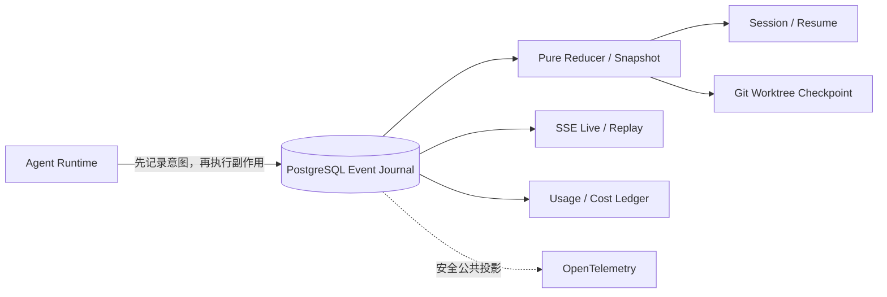

<p align="center">
  
</p>

<h1 align="center">Witness</h1>

<p align="center">
  <strong>可观测、可追溯、可恢复的 ReAct Agent Runtime</strong>
</p>

<p align="center">
  PostgreSQL Event Sourcing · Session Resume · Trace Replay · Git Worktree · OpenTelemetry
</p>

## 项目目标

Witness 面向需要长时间运行、会调用工具并可能修改代码仓库的 Agent 任务。它不只实现一层
ReAct 循环，还提供一套可审计的执行底座：把已经提交的事件作为唯一事实源，让运行状态能够
重建、任务能够恢复、历史轨迹能够回放，并把可观测性与任务正确性解耦。

> 自研可观测、可追溯 Agent Runtime：自研事件溯源 Agent Runtime，以追加式事件日志统一记录模型决策、工具调用与执行结果，运行状态均可从日志重建；打通 Session Resume、模型/工具轨迹 Replay 与 Trace/成本统计，使仓库级长任务在进程中断后可续跑、历史执行可复现、问题链路可审计。

项目遵循三个核心原则：

1. **先记录意图，再执行副作用**：模型调用和工具执行都有明确的 durable 提交边界。
2. **日志是事实，Snapshot 是缓存**：删除 Snapshot 后仍可从 sequence 1 精确重建运行状态。
3. **可观测性不参与正确性**：OpenTelemetry 只消费已提交事件的安全投影，采样或导出失败不影响任务执行与恢复。

## 当前实现情况

当前主线已经具备可运行的事件溯源 Runtime、调试工作台和本地可观测栈，而不是只有接口设计。

| 能力 | 状态 | 当前实现 |
| --- | --- | --- |
| ReAct Core | ✅ 已实现 | OpenAI Responses / Chat Completions、严格 tool schema、并发与预算限制 |
| 事件溯源 | ✅ 已实现 | 版本化事件、纯 reducer、upcaster、严格 sequence、前向 hash chain |
| PostgreSQL Journal | ✅ 已实现 | PostgreSQL 16+、CAS、幂等 operation、租约、fencing、Session 单活 Run |
| Session Resume | ✅ 已实现 | 新 execution 恢复、模型 abandoned、工具恢复策略、人工 reconciliation |
| Live / Replay | ✅ 已实现 | durable SSE、实时模型 delta、Timeline、Audit、只读 Replay、安全 Fork |
| 仓库级任务 | ✅ 已实现 | Session 隔离 Git worktree、前后 checkpoint、diff 摘要与偏离检测 |
| Token / 成本 | ✅ 已实现 | usage 明细、冻结成本记录、独立追加式成本调整账本、Session 汇总 |
| OpenTelemetry | ✅ 已实现 | Agent / model / tool span、Resume Span Link、GenAI metrics、隐私投影 |
| 前端工作台 | ✅ 已实现 | Live、Timeline、Audit、Replay、Workspace Diff、Cost、History |
| 跨主机搬迁 worktree | ◻️ 暂未覆盖 | 当前支持同机多进程或共享 Git 存储；跨主机工作区迁移留待后续阶段 |

当前验证基线：`220 passed, 18 skipped`，另有 `18 passed` 的真实 PostgreSQL 集成测试；Ruff、
Mypy 和 wheel 构建均通过，发布包内包含 `001–010` 数据库 migration。

## 架构概览



PostgreSQL 追加日志是生产模式下的唯一事实源；Snapshot 可以删除并重建，`LISTEN/NOTIFY`
只负责唤醒 follower。Replay 只 fold 历史事件，不调用模型、工具或修改 Session。

## ReAct Core

底层是一个小而明确、面向生产约束的 Python ReAct Agent 核心。它使用 OpenAI 风格的结构化
function/tool calling，不解析脆弱的 `Thought / Action / Observation` 文本，也不会要求模型公开
或保存私有思维链。

框架把一次运行建模为有限循环：

```text
用户目标
  -> 模型返回最终回答 --------------------------> 完成
  -> 模型返回结构化 tool calls
       -> 参数校验 -> 审批策略 -> 执行工具
       -> 将每个结果按 call id 写回模型
       -> 下一轮模型决策
```

每个 assistant tool call 都会得到且只得到一个匹配 ID 的 tool result；未知工具、参数错误、审批拒绝、超时和工具异常也会转换成结构化 observation，而不是破坏消息协议。

### 核心能力

- 默认使用 OpenAI Responses API；可切换到 Chat Completions，兼容只实现 `/v1/chat/completions` 的服务。
- 使用 Pydantic 从带类型注解的 Python 函数生成严格 JSON Schema，并在本地再次校验模型参数。
- 工具显式注册和白名单分发，不通过模型输出反射执行任意函数。
- 支持同步或异步工具、单工具超时、受控并发和顺序稳定的结果回写。
- 高风险工具可声明 `requires_approval=True`；没有审批处理器时默认拒绝。
- 提供步数、工具调用数、总墙钟时间、并发数、工具输出长度和重复动作限制。
- 返回结构化 `AgentResult`，并产生默认不包含 prompt、参数和工具输出的安全事件。
- 可选的实时 observer 支持模型文本 delta、工具调用与执行生命周期；调试数据不写入
  `AgentResult.events` 或会话 transcript。
- 显式区分完成、截断、不完整输出和拒绝；不执行 `length/incomplete` 响应中的工具参数。
- API key 不进入框架对象的 `repr`；第三方兼容服务的信任边界由调用方明确决定。

## 安装

需要 Python 3.11 或更高版本。在仓库根目录执行：

```bash
uv sync --extra dev
```

若不使用 uv，也可以执行 `python -m pip install -e .`。基础安装包含 OpenAI SDK、Pydantic、
FastAPI/Uvicorn 和 PostgreSQL adapter；OpenTelemetry 仍是独立的 `otel` extra。

然后设置至少两个环境变量：

```bash
export OPENAI_API_KEY="你的 API key"
export OPENAI_MODEL="你的模型名"
python examples/quickstart.py
```

`examples/quickstart.py` 中的订单金额工具完全在本地计算、不访问网络；Agent 调用模型本身仍然需要配置好的 API endpoint。

本项目不会自动读取 `.env` 文件。可以参考 [`.env.example`](.env.example) 后使用 shell、部署平台的 secret manager，或应用自己的配置层注入环境变量。

## 环境变量

| 变量 | 是否必需 | 含义 |
| --- | --- | --- |
| `OPENAI_API_KEY` | 是 | OpenAI 或可信兼容服务的 API key；OpenAI SDK 也会读取它。 |
| `OPENAI_MODEL` | 是 | CLI 和 quickstart 使用的模型名。库的 `OpenAIModel(model=...)` 仍要求显式传入模型名。 |
| `OPENAI_BASE_URL` | 否 | 兼容服务入口，例如 `https://example.com/v1`。未设置时使用 OpenAI SDK 默认值。 |
| `OPENAI_API_MODE` | 否 | `responses`（默认）或 `chat_completions`；由 CLI 和 quickstart 读取。 |
| `OPENAI_COMPAT_MODE` | 否 | Web 兼容模式；`true` 时省略 strict/store/parallel 等常被第三方拒绝的可选字段。 |
| `OPENAI_ALLOW_INSECURE_HTTP` | 否 | 默认 `false`；仅可信私网且无法提供 HTTPS 时才允许设为 `true`。 |
| `REACT_AGENT_POSTGRES_DSN` | 生产建议 | Durable journal DSN，优先于 `DATABASE_URL`；必须作为 secret 注入。 |
| `DATABASE_URL` | 否 | PostgreSQL DSN 的兼容 fallback。两个 DSN 都未设置时使用进程内 journal。 |
| `REACT_AGENT_REPOSITORY` | 否，成对 | 要隔离操作的 non-bare Git worktree。必须与 `REACT_AGENT_WORKTREE_ROOT` 同时设置。 |
| `REACT_AGENT_WORKTREE_ROOT` | 否，成对 | Session worktree 的独立 managed root；不能与 repository 互相包含。 |
| `REACT_AGENT_WEB_HOST` | 否 | Web 监听地址，默认 `127.0.0.1`。 |
| `REACT_AGENT_WEB_PORT` | 否 | Web 监听端口，默认 `8000`。 |
| `OTEL_SERVICE_NAME` | 否 | OpenTelemetry service name。 |
| `OTEL_EXPORTER_OTLP_ENDPOINT` | 否 | OTLP Collector endpoint；需先初始化 OTel SDK/provider。 |
| `OTEL_EXPORTER_OTLP_PROTOCOL` | 否 | 本地示例使用 `http/protobuf`。 |
| `OTEL_TRACES_EXPORTER` | OTel 本地栈 | 设为 `otlp` 才会由 auto-instrumentation 初始化 trace exporter。 |
| `OTEL_METRICS_EXPORTER` | OTel 本地栈 | 设为 `otlp` 才会由 auto-instrumentation 初始化 metric exporter。 |
| `OTEL_LOGS_EXPORTER` | OTel 本地栈 | 设为 `otlp` 才会由 auto-instrumentation 初始化 log exporter。 |
| `REACT_AGENT_OTEL_METRIC_ALLOWED_MODELS` | 否 | 逗号分隔的精确模型 metric label allowlist；未设置时 Web 固定使用当前 `OPENAI_MODEL`。最多 64 项，不支持通配符。 |
| `REACT_AGENT_OTEL_METRIC_ALLOWED_TOOLS` | 否 | 逗号分隔的精确工具 metric label allowlist；未设置时 Web 固定使用启动时已注册工具名。最多 64 项，不支持通配符。 |

不要提交真实 key。第三方 `OPENAI_BASE_URL` 会收到用户消息、工具定义和工具结果，只应连接你信任的服务，并保持 TLS 校验开启。
非回环地址默认必须使用 HTTPS；可信内网若只能使用 HTTP，需要显式传入
`allow_insecure_http=True`（CLI 对应 `--allow-insecure-http`）。

## 快速使用

下面是 quickstart 的核心形式：

```python
import asyncio

from react_agent import AgentConfig, OpenAIModel, ReActAgent, tool


@tool(timeout_s=2.0)
def add(left: float, right: float) -> dict[str, float]:
    """在本地计算两个数的和。"""
    return {"sum": left + right}


async def main() -> None:
    async with OpenAIModel("your-model") as model:
        agent = ReActAgent(
            model,
            tools=[add],
            config=AgentConfig(max_steps=4, max_tool_calls=4),
        )
        result = await agent.run("请务必调用工具计算 19.5 + 22.7。")
        print(result.output or f"停止原因：{result.stop_reason.value}")


asyncio.run(main())
```

`OpenAIModel` 使用 `AsyncOpenAI`，因此框架核心是原生异步的。同步工具会在线程中运行；
Python 无法安全杀掉已经启动的线程，所以 timeout 只会停止等待，底层同步函数仍可能继续。
需要强隔离、可强制终止、不可重复副作用或处理不可信代码的工具，必须放入独立进程/worker，
并使用 `run_id + call_id` 作为服务端幂等键。

## 定义 typed tool

`@tool` 会读取函数签名和 docstring。每个参数都必须有类型注解，不能使用 `*args`、`**kwargs` 或 positional-only 参数：

```python
from typing import Annotated

from pydantic import Field
from react_agent import tool


@tool(
    name="lookup_inventory",
    description="查询本地库存；不执行预留或下单。",
    timeout_s=3.0,
    idempotent=True,
    parallel_safe=True,
)
def lookup_inventory(
    sku: Annotated[str, Field(min_length=1, max_length=64)],
    warehouse_id: Annotated[int, Field(ge=1)],
) -> dict[str, int | str]:
    return {"sku": sku, "available": 12}
```

装饰器生成 OpenAI strict function schema：object 禁止额外字段，并把属性列入 `required`。需要表达“必传但可以为空”的参数时，使用 `T | None`。无论服务端是否支持 strict schema，本地 Pydantic 校验始终执行。
工具名、描述和参数说明应让人无需额外背景也能正确调用；初始暴露的工具应尽量少（官方文档给出的软建议是少于 20 个），大型工具集应在应用层按任务动态筛选。

工具成功和失败都会被封装成 JSON：

```json
{"ok":true,"data":{"sum":42.2},"meta":{"truncated":false}}
```

```json
{"ok":false,"error":{"code":"INVALID_ARGUMENTS","message":"...","retryable":false}}
```

## 审批高风险工具

审批发生在参数解析和校验之后、工具执行之前：

```python
import asyncio

from react_agent import ApprovalRequest, ReActAgent, tool


@tool(
    requires_approval=True,
    idempotent=False,
    parallel_safe=False,
)
def send_message(recipient: str, body: str) -> dict[str, str]:
    """向外部收件人发送消息。"""
    # 在真实应用中调用受控消息服务。
    return {"status": "sent", "recipient": recipient}


async def approve(request: ApprovalRequest) -> bool:
    answer = await asyncio.to_thread(
        input,
        f"允许 {request.tool_name} 使用参数 {dict(request.arguments)!r}？[y/N] ",
    )
    return answer.strip().lower() == "y"


# agent = ReActAgent(model, [send_message], approval_handler=approve)
```

若没有提供 `approval_handler`，所有 `requires_approval=True` 的调用都会得到 `TOOL_DENIED`。审批只是最后一道策略钩子；真实写操作仍应使用最小权限凭据、审计日志和服务端幂等键。
审批回调看到的是参数的深拷贝快照；即使回调误改嵌套值，也不会改变随后真正执行的参数。

## 限制与并发

`AgentConfig` 的所有限制都作用于单次 `run()`：

```python
from react_agent import AgentConfig

config = AgentConfig(
    max_steps=8,
    max_tool_calls=32,
    max_wall_time_s=120.0,
    max_concurrent_tools=8,
    max_tool_output_chars=20_000,
    max_context_chars=200_000,
    parallel_tool_calls=True,
    repeated_action_limit=3,
)
```

- `max_steps`：模型决策轮数上限，包括最后回答所在的模型调用。
- `max_tool_calls`：模型请求的 tool call 总数上限。
- `max_wall_time_s`：模型与工具执行共享的总 deadline；它约束 Agent 停止等待的时间，
  不是对已启动同步线程或外部系统副作用的强制终止保证。
- `max_concurrent_tools`：同一轮最多同时执行的工具数。
- `max_tool_output_chars`：单个 observation 的最大字符数，超出时返回带元数据的安全预览。
- `max_context_chars`：发送模型前的保守字符预算，包含 instructions、工具 schema 和完整
  transcript；超限时明确停止，由应用压缩或总结旧历史后再继续。
- `parallel_tool_calls`：只有同一批工具都允许 `parallel_safe` 时才并发；结果仍按请求顺序写回。
- `repeated_action_limit`：同一次 run 内相同工具与参数达到阈值时停止，即使结果含时间戳或
  随机值也能识别；同时也能识别
  `A/B/A/B` 交替循环。确实需要稳定轮询的工具可显式设置 `allow_repeated=True`。

工具默认 `idempotent=False`、`parallel_safe=False`，需要作者在确认语义后显式放开；框架只在
`idempotent=True` 时把工具超时标记为可重试，但不会擅自重试有副作用的工具。

预算耗尽、循环检测和总超时是正常终态，不会伪装成成功回答。检查 `result.status` 与 `result.stop_reason`，不要只判断 `result.output`。
供应商的 `length`、`incomplete`、`content_filter` 和 refusal 也会映射为明确终态。

## 事件与结果

事件可用于 CLI 进度、结构化日志或 tracing：

```python
from react_agent import AgentEvent, ReActAgent


def on_event(event: AgentEvent) -> None:
    print(
        event.kind.value,
        event.run_id,
        event.step,
        event.tool_name,
        dict(event.data),
    )


# agent = ReActAgent(model, tools, event_sink=on_event)
```

事件包括 `run_started`、模型开始/完成/失败、工具开始/完成/复用、预算耗尽、循环检测和 `run_completed`。默认事件不含原始 prompt、工具参数或工具输出；若应用自行补充日志字段，应先做脱敏。
同步事件回调会在线程中执行，避免阻塞 Agent 的事件循环；事件回调仍应保持短小、无副作用。

需要制作实时调试界面时，可以为单次运行显式传入 `stream_sink`。它与上面的安全日志事件是
两条独立通道：前者是临时、可背压、严格保序的 rich event，后者仍保持 metadata-only。

```python
from react_agent import AgentStreamEvent


async def inspect(event: AgentStreamEvent) -> None:
    # data 可能包含被工具作者显式批准展示的参数或结果，不要直接写入生产日志。
    await websocket_or_queue.send(event)


result = await agent.run("请调用工具计算 21 * 2", stream_sink=inspect)
```

模型端的增量只用于 UI。框架仍会等待 SDK 返回完整终态并重新解析最终 `ModelResponse`，确认
outcome 为 completed 后才执行工具；部分 JSON 参数、截断输出或断线不会触发工具。provider 原始
事件、system instructions、完整 history、reasoning 和 encrypted reasoning 永远不会通过这条
observer 转发。

工具的调试暴露策略默认是 `DebugExposure.METADATA`，只显示名称、字符数、状态和耗时。
只有参数与结果确实适合交给前端时，工具作者才能显式启用完整展示：

```python
from react_agent import DebugExposure, tool


@tool(debug_exposure=DebugExposure.FULL)
def local_calculator(expression: str) -> dict[str, str]:
    """计算不含凭据或个人数据的本地表达式。"""
    return {"expression": expression}
```

不要给读取凭据、文件、用户数据或第三方响应的工具启用 `FULL`。浏览器网络面板同样可以看到
rich event；调试面板不是秘密存储。

`AgentResult` 包含：

- `output`、`status`、`stop_reason` 和可能的安全错误信息；
- `run_id`、模型调用次数、tool call 数和实际工具执行次数；
- 供应商返回的累计 token usage；兼容服务不返回 usage 时对应值为零；
- 完整 typed transcript 和本次运行的事件快照。

## Responses 与 Chat Completions

官方 OpenAI 默认配置：

```python
model = OpenAIModel("your-model", api_mode="responses")
```

默认 `store=False`，并请求/回放加密 reasoning items，使工具循环可以在无服务端持久状态下继续；
完整 provider items 保存在 transcript 的不透明字段中且不会进入 `repr`。若兼容端点不支持该字段，
关闭 `encrypted_reasoning_items`，或改用 Chat Completions。

只提供 Chat Completions 的兼容服务：

```python
model = OpenAIModel(
    "provider-model",
    api_mode="chat_completions",
    api_key="...",
    base_url="https://trusted-provider.example/v1",
)
```

若兼容服务会拒绝 `strict` 或 `parallel_tool_calls` 字段，可显式降级 wire protocol；本地参数校验不会关闭：

```python
from react_agent import AgentConfig, OpenAIModel, ProviderCapabilities, ReActAgent

model = OpenAIModel(
    "provider-model",
    api_mode="chat_completions",
    base_url="https://trusted-provider.example/v1",
    capabilities=ProviderCapabilities(
        strict_tools=False,
        parallel_tool_calls=False,
        store_parameter=False,
        encrypted_reasoning_items=False,
    ),
)
agent = ReActAgent(
    model,
    tools,
    config=AgentConfig(parallel_tool_calls=False),
)
```

兼容服务对 token 参数的支持并不一致。只有确认 endpoint 接受对应参数时再设置 `max_output_tokens`；默认 `None` 不发送该字段。
模型网络重试只交给 OpenAI SDK 的 `max_retries`，Agent 核心不再叠加第二层指数退避，避免重试倍增。

## CLI

CLI 适合验证 endpoint；它本身不注册应用工具：

```bash
react-agent "用一句话解释结构化 tool calling"
react-agent --api-mode chat_completions --compat "你好"
```

`--compat` 会省略 `strict`、`parallel_tool_calls` 和 `store` 等可选 provider 字段。

## Durable Runtime

`ReActAgent` 负责一次确定的模型/工具循环；`AgentRuntime` 在其外层提供可恢复执行、Session
提交、事件跟随、成本记录、遥测和可选工作区检查点。每个 Run 都是一条 append-only 事实链：

- durable event 使用严格递增的 `sequence`，并通过前向 hash 链校验缺失、乱序或篡改；
- append 与 Session commit 使用 compare-and-swap，避免多 worker 静默覆盖状态；
- Start/Fork 接受幂等键，相同请求只会保留一个 Run；
- 执行权由带 fencing token 的租约保护，过期 worker 无法继续提交事实；
- Replay 只从事件折叠状态，恢复逻辑不会从日志文本猜测下一步。

生产环境应把 PostgreSQL journal 作为唯一 source of truth。PostgreSQL 的 `LISTEN/NOTIFY`
只负责低延迟唤醒 follower，不承载事实；消费者始终按 `sequence` 查询表，并有轮询兜底，因此
通知合并、丢失或进程重启不会丢 durable event。未配置数据库时使用 `InMemoryRunJournal`，适合
本地开发和单进程测试，但进程重启后 Run、Session、幂等预留与恢复状态都会丢失。

## PostgreSQL 与独立 migration

Web 启动时优先读取 `REACT_AGENT_POSTGRES_DSN`，未设置时兼容读取 `DATABASE_URL`。应用不会在
启动路径自动建表或升级 schema；生产发布应先运行一次独立 migration job，再滚动启动应用：

```bash
uv run python - <<'PY'
import asyncio
import os

from react_agent.postgres_journal import PostgresRunJournal


async def main() -> None:
    async with PostgresRunJournal(
        os.environ["REACT_AGENT_POSTGRES_DSN"]
    ) as journal:
        await journal.migrate()


asyncio.run(main())
PY
```

DSN 只从环境或 secret manager 注入，不要放进命令参数、镜像、日志或仓库。migration 是幂等的，
并使用 PostgreSQL advisory lock 防止多个部署任务并发升级。应用账号和 migration 账号可按最小权限
分离；若两个 DSN 变量同时存在，以 `REACT_AGENT_POSTGRES_DSN` 为准。

Public event 虽然已经脱敏，但数据库中的 private checkpoint 可能包含完整 transcript、工具调用参数
与工具结果；provider raw state、reasoning 和原始流事件不会写入 journal。应限制基表与备份的访问，
启用传输/静态加密，并按组织策略设置保留期；不要把 PostgreSQL 当作可以公开查询的日志库。

Migration 会创建不含 `private_payload` 的安全屏障视图
`react_agent_public_run_events`。部署方可把该视图的 `SELECT` 单独授予 Observer/Audit 角色，同时明确
撤销该角色对 `react_agent_run_events`、Snapshot 与 Session 基表的权限；Runtime 角色仍需按其读写
路径授予最小权限。Migration 不会擅自创建组织角色，也不会修改已有角色成员关系。

未设置任一 DSN 时 Web 仍可启动，但这是明确的进程内模式，不具备跨进程协调或跨重启持久性。
生产环境不要把这个 fallback 当作数据库故障时的自动降级。

## Runtime HTTP API

工作台优先使用 durable Runtime API；旧的 `/api/chat` 和 `/api/chat/stream` 仍通过 Runtime
facade 保持兼容。

| 方法 | 路径 | 用途 |
| --- | --- | --- |
| `POST` | `/api/runs` | 创建 Run，返回 `202` Run handle。 |
| `GET` | `/api/runs/{run_id}` | 读取当前脱敏 snapshot。 |
| `GET` | `/api/runs/{run_id}/events?after_sequence=0&follow=true` | 重放 durable event，并可继续跟随 live event。 |
| `GET` | `/api/sessions/{session_id}/runs` | 列出一个 Session 的 Run 历史。 |
| `POST` | `/api/runs/{run_id}/resume` | 从 durable state 恢复执行。 |
| `POST` | `/api/runs/{run_id}/fork` | 从安全 checkpoint 创建独立 lineage。 |
| `POST` | `/api/runs/{run_id}/resolve` | 处理需要人工确认的未知工具状态。 |
| `POST` | `/api/runs/{run_id}/cost-adjustments` | 追加账单/人工成本修订，并返回合并后的 snapshot。 |
| `POST` | `/api/runs/{run_id}/cancel` | 显式请求取消后台 Run。 |

Runtime Start 使用 `prompt` 字段；兼容接口 `/api/chat` 与 `/api/chat/stream` 继续使用
`message`。对 Start 和 Fork 建议总是发送稳定的
`Idempotency-Key`；同一个 key 如果对应不同请求内容会返回冲突，而不是误复用：

```bash
curl -sS http://127.0.0.1:8000/api/runs \
  -H 'Content-Type: application/json' \
  -H 'Idempotency-Key: client-request-001' \
  -d '{"prompt":"请调用工具计算 21 * 2","session_id":"demo-session"}'
```

Reconciliation 的操作是 `retry`、`use_result` 或 `abort`：

```json
{
  "call_key": "stable-call-key",
  "action": "use_result",
  "result": {"ok": true, "data": {"status": "confirmed"}}
}
```

`use_result` 只应提交操作员已从外部系统确认过的结果。不要通过它猜测一个有副作用的调用是否成功。

成本修订建议始终发送稳定的 `Idempotency-Key`。`revised_total_microunits` 是该模型操作修订后的
总成本（货币微单位），不是本次差额；Runtime 会把差额作为新的 immutable record 追加：

```json
{
  "previous_record_id": "cost-record-id",
  "revised_total_microunits": 375,
  "note": "provider invoice"
}
```

## SSE、流式输出与断线恢复

Runtime SSE 明确区分两类事件：

- durable event 是可恢复事实，带 SSE `id`，其值就是 durable `sequence`；
- 模型文本/refusal/tool-call delta 是低延迟 live event，没有 SSE `id`，不会伪造恢复游标。

客户端重连时可同时发送查询参数 `after_sequence` 和请求头 `Last-Event-ID`，服务端取两者中的
较大值。重连会从 PostgreSQL 重放 durable facts，再继续跟随当前执行；瞬时 token delta 只用于改善
现场体验，不承诺重放。模型完成后的权威文本和最终回答会进入脱敏 snapshot，因此即使中间 delta
缺失，工作台仍能恢复最终答案和执行状态。

关闭 SSE follower、刷新页面或点击工作台的“停止关注”只会断开该浏览器订阅，不会取消后台 Run。
只有调用 `/cancel`（或工作台对应的显式 Cancel 操作）才是取消请求。follower 断开后 Runtime 继续
执行并写 journal；页面把 durable 游标保存在 `sessionStorage`，恢复后从该游标重连。

## Resume 恢复矩阵

恢复必须依据已经提交的事实和工具的幂等声明，不能依靠“通常不会重复”的假设：

| 中断状态 | Resume 行为 |
| --- | --- |
| 模型调用已开始但未提交完成 | 写入 `model_abandoned`，将该次成本记为未知，再发起新的模型 attempt。 |
| 工具已计划但尚未执行 | 从 durable tool plan 继续。 |
| 幂等工具执行中断 | 使用稳定 idempotency key 自动重试。 |
| 工具已完成或已有复用事实 | 使用 durable `ToolMessage`，不重复执行 provider。 |
| 非幂等工具状态不确定 | Fail closed，进入 reconciliation，不调用 provider。 |
| 已有 final result、仅 Session commit 中断 | 幂等完成 commit，不重复调用模型或工具。 |
| Agent revision 或 tool manifest 不一致 | `ResumeRejected`；需要显式 Fork。 |
| Run 绑定 workspace，但恢复进程未配置 workspace adapter | `ResumeRejected`。 |
| Workspace 偏离且待恢复工具幂等 | 恢复最后安全 checkpoint 后重试。 |
| Workspace 偏离且待恢复工具非幂等 | 不恢复、不重放，进入 reconciliation。 |
| Run 已是终态 | 返回现有状态，不创建新的 execution。 |

`retry` 仅适用于可以安全重试、或操作员已经确认外部系统没有执行原调用的情况；
`use_result` 注入已核实的结果；`abort` 以显式事实终止 Run。

## Replay 与 Fork

Replay 是 public durable event 上的只读纯 reducer：不调用模型、不执行工具、不写新事件，也不产生
telemetry。它适合审计、历史查看和 UI 时间旅行，但不能展示被隐私策略排除的 prompt、reasoning、
凭据或 opaque provider state。

Fork 只允许从标记为 safe 的 durable checkpoint 创建。新 Run 使用独立 Session 和独立 workspace
lineage；父 Run 保持不可变。需要改变 Agent revision、工具清单或从旧执行探索另一条路径时，应 Fork，
而不是绕过 Resume 的一致性检查。

## 隔离 Git worktree

同时设置 `REACT_AGENT_REPOSITORY` 与 `REACT_AGENT_WORKTREE_ROOT` 可启用 workspace adapter：

- 每个 Session 在 managed root 下拥有一个 detached Git worktree，主工作树不会被直接修改；
- checkpoint 使用内部 Git ref 固定不可变 tree，并记录内容无关的 diff 摘要；
- `.env`、私钥、证书、credentials、云凭据等敏感路径默认拒绝进入 checkpoint；
- repository 必须是真实的 non-bare Git worktree；managed root 不能是 symlink；
- repository 与 managed root 必须互不包含，避免清理或 Git 操作越界。

两个变量必须成对设置。路径约束不满足时应用会 fail closed，而不是退回主工作树执行。

## 成本账本

成本是 append-only ledger：模型完成时的冻结估算写入 Run 的 `cost_recorded` 事实；供应商账单或
人工修订则追加到独立的 `react_agent_cost_adjustments` 审计账本，不会原地改写历史。独立账本有自己的
`ledger_sequence`，它不是 Run durable sequence，不能用作 SSE `Last-Event-ID`。因此即使 Run 已经
terminal，对账也不会重开 Run、改变 terminal sequence/hash，或伪造一个 terminal 后事件。

`GET /api/runs/{run_id}` 和 Session history 会在读取时合并两个账本，页面刷新后 Cost 页签也会展示
修订记录。token usage 始终保留；如果当前 pricing catalog 没有匹配价格，成本是 `null/unknown` 并
附带原因，绝不能显示为 0。未完成的模型 attempt 也可能已经计费，因此 Resume 会把它记录为成本
未知。修订必须引用当前操作链的最新 `record_id`；稳定 `Idempotency-Key` 的相同重试只写一条，
相同 key 或 record id 对应不同内容会返回冲突。

工作台的 Cost 页签展示逐条 ledger、累计值和未知原因，适合后续接账单对账，但它不是供应商发票。

## ReAct 调试工作台

项目自带同源 FastAPI 单页工作台。左侧是流式对话，右侧提供：

- **Live**：当前 Run、执行阶段、模型与工具卡片、预算、usage 和人工处置入口；
- **Timeline**：按收到顺序展示模型 delta、工具计划/参数、开始、结果、错误与终态；
- **Audit**：按 durable/live 序号检查公共事件 JSON、缺口与重复；
- **Replay**：拖动 durable sequence，从纯 reducer 查看当时状态并从安全点 Fork；
- **Workspace Diff**：查看 checkpoint、偏离状态与内容无关的 diff 摘要；
- **Cost**：查看估算、调整、累计成本和 unknown 原因；
- **History**：读取 Session Run 历史并重新连接后台执行。

API key 只保留在服务端环境变量中，不会发送给浏览器。使用兼容端点时：

```bash
export OPENAI_API_KEY="你的 API key"
export OPENAI_BASE_URL="https://trusted-provider.example/v1"
export OPENAI_MODEL="gpt-5.6-terra"
export OPENAI_API_MODE="chat_completions"
# 仅当兼容服务拒绝 strict/store/parallel 等可选字段时启用：
export OPENAI_COMPAT_MODE=true
uv run react-agent-web
```

打开 <http://127.0.0.1:8000/>。默认只监听 `127.0.0.1`；可通过
`REACT_AGENT_WEB_HOST` 和 `REACT_AGENT_WEB_PORT` 修改。页面优先使用 Runtime API，旧服务没有
这些路由时才回落到 `/api/chat/stream`。内置 `calculate_expression` 只允许基础算术，并显式允许
在调试 UI 展示参数与结果；其他工具默认只暴露 metadata。

浏览器网络面板和 `sessionStorage` 都能看到获准公开的调试数据。不要给读取凭据、文件、个人数据或
第三方敏感响应的工具启用 `DebugExposure.FULL`，也不要把工作台暴露到不可信网络。

## OpenTelemetry

OpenTelemetry 是可选能力。安装 adapter 与自动 instrumentation，并连接本地 Collector：

```bash
uv sync --extra otel
docker compose -f docker-compose.observability.yml up -d

export OTEL_SERVICE_NAME=react-agent
export OTEL_EXPORTER_OTLP_ENDPOINT=http://127.0.0.1:4318
export OTEL_EXPORTER_OTLP_PROTOCOL=http/protobuf
export OTEL_TRACES_EXPORTER=otlp
export OTEL_METRICS_EXPORTER=otlp
export OTEL_LOGS_EXPORTER=otlp
# 可选：为本地验收显式固定有界 metric labels；不要使用通配符。
export REACT_AGENT_OTEL_METRIC_ALLOWED_MODELS=gpt-5.6-terra
export REACT_AGENT_OTEL_METRIC_ALLOWED_TOOLS=calculate_expression
uv run opentelemetry-instrument react-agent-web
```

Jaeger UI 位于 <http://127.0.0.1:16686>，Prometheus UI 位于
<http://127.0.0.1:9090>。完整的启动、检查、tail sampling 与生产注意事项见
[`deploy/otel/README.md`](deploy/otel/README.md)。

Telemetry 使用显式 allowlist，不导出 prompt、system instructions、工具参数/结果、reasoning、
provider 原始事件或凭据；Replay 完全抑制 telemetry。Web 默认把当前配置的单个模型名和启动时
有限的工具 registry 冻结为 metric allowlist，因此 `gpt-5.6-terra` 与
`calculate_expression` 在默认验收中不会退化为 `other`。部署可用上述变量精确覆盖；每项最多
64 个、单值最多 128 字符，空项、控制字符和 `*` 均会让启动失败。`run_id`、`request_id`、
`tool_call_id` 等高基数字段可用于 trace/log 关联，但不会作为 metric dimensions。OTel API
不可用时 `create_telemetry()` 返回 NoOp；只安装 API 而未初始化 SDK/provider 时也不会导出数据。

## 开发验证

```bash
uv run ruff check .
uv run mypy src/react_agent examples/quickstart.py
uv run pytest -q
uv build
```

默认测试不访问网络：Agent 循环使用 deterministic fake model，协议测试使用真实 OpenAI
SDK 加 `httpx.MockTransport`。真实 endpoint 应通过 quickstart 或 CLI 单独验证，避免把 live
API 调用放进默认 CI。

## OpenAI Docs

- [Function calling：工具定义、call ID、并行调用与 strict mode](https://developers.openai.com/api/docs/guides/function-calling/)
- [迁移到 Responses API](https://developers.openai.com/api/docs/guides/migrate-to-responses/)
- [Responses API：Create a model response](https://developers.openai.com/api/reference/resources/responses/methods/create/)
- [Chat Completions API：Create chat completion](https://developers.openai.com/api/reference/resources/chat/subresources/completions/methods/create/)
