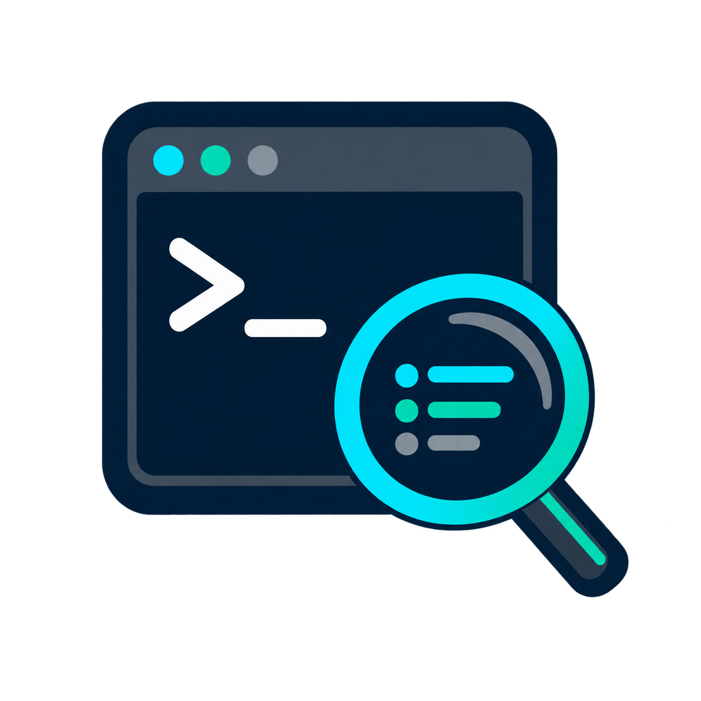

<p align="center">
  
</p>

<h1 align="center">Witness</h1>

<p align="center">
  <strong>CI 自动修复 Agent Runtime</strong>
</p>

<p align="center">
  面向 CI 失败分析、代码修复与验证 · 可恢复执行 · 隔离工作区 · 可追溯证据
</p>

<p align="center">
  <a href="https://github.com/CodeNoob-SEU/Witness/actions/workflows/ci.yml">
    
  </a>
  
  
</p>

## 项目目标

**Witness 是一个 CI 自动修复 Agent Runtime。** 面向由 CI 失败触发的代码修复，驱动 Agent
分析失败日志、定位问题、生成补丁，并通过重新运行检查验证修复结果。

Runtime 为修复链路提供可恢复执行、隔离工作区和可追溯证据，目标是交付经过验证、可供审核的
代码变更。PR 是交付补丁的一种方式。

## 30 秒版本

| 关注点 | Witness 的定位 |
| --- | --- |
| 解决什么问题 | 代码提交后，测试、编译、类型检查或 lint 等 CI 检查失败 |
| 如何修复 | 获取失败日志与代码版本 → 复现定位 → 生成补丁 → 运行验证 → 交付结果 |
| Runtime 提供什么 | 中断恢复、工具执行协调、隔离 worktree、轨迹回放与成本记录 |
| 如何判断修好 | 核对失败检查和回归结果、补丁及对应代码版本；执行轨迹供审核参考 |

目前已具备 Runtime、仓库工具和本地演示，真实 CI 接入与自动修复闭环仍待贯通。

## 快速体验

需要 Python 3.11+ 和 [uv](https://docs.astral.sh/uv/)，在仓库根目录运行：

```bash
uv sync --extra dev
uv run react-agent-web --demo
```

打开 <http://127.0.0.1:8000/>，查看任务、补丁、执行轨迹和恢复证据。离线演示使用脚本化模型，
无需 API key；用于体验已有 Runtime 能力。

## 文档

- [使用与实现指南](docs/GUIDE.md)：实现边界、安装配置、工具、API、恢复机制、评测和开发验证。
- [设计取舍](docs/DESIGN.md)：执行原则、架构决策及其代价。
- [修复与发布恢复演示](examples/project_pr_demo/README.md)：本地 Crash-to-Proof PR 的运行方式与证据。
- [真实仓库修复记录](analysis_outputs/swebench_e2e_20260904/README.md)：SWE-bench 单任务验证及中断恢复工件。
