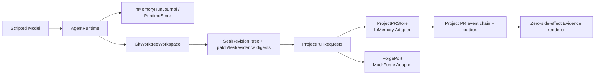

# Crash-to-Proof PR：本地 P0 Vertical Slice

这个 Demo 面向面试或技术评审，集中展示一件事：

> 当 coding worker 和 PR publisher 分别在关键副作用边界中断时，Witness 如何从已经提交的事实恢复，避免盲目重复外部写入，并生成一份可复核的 PR Evidence。

它不是一个“模型更聪明”的演示。模型响应、代码改动和故障位置都是确定性的，目的是把 Runtime 的恢复协议单独暴露出来，避免现场模型随机性掩盖系统能力。

当前实现是一个本地 P0 vertical slice：核心状态机、outbox、observe-before-write、lease/fencing、worktree 恢复和 Evidence renderer 都是真实代码；Forge、PR store、Runtime journal 和模型则使用本地或内存 Adapter。它不连接 GitHub，也不是生产部署方案。

## 30 秒定位

普通 coding-agent Demo 通常只展示“读代码、改代码、跑测试”。本 Demo 追加两个更难的故障问题：

1. 工具已经开始修改 worktree，但 worker 在结果提交前消失，下一任 worker 能否恢复到可信 checkpoint 后再安全重试？
2. 远端 check 已经创建，但 publisher 没收到返回值，下一任 publisher 会不会盲目再次创建一个重复 check？

本地成功路径的验收结果是：

- coding worker 接管 1 次，重试前恢复到原始 PR head 内容；
- publisher 接管 1 次，fence 从 1 递增到 2；
- outbound create 调用 1 次，物理 check 也只有 1 个；
- 恢复 publisher 通过精确观察收养已有 check，而不是再次 create；
- 主 worktree 不被 Agent 修改；
- PR workflow 生成 6 条 hash-chained facts 和一组确定性 Evidence 工件。

## Demo 架构与 seams



`ProjectPullRequests` 位于 `AgentRuntime` 之上，是项目级 PR 的 deep Module。外部调用者只提交四类 reviewer-level command：

- `StartPR`：把 workflow 锚定到 repository、PR number、base SHA 和 head SHA；
- `SealRevision`：封存同一 candidate tree 对应的 patch、verification 和 source-evidence digest；
- `PublishPR`：在 head 未漂移的前提下批准发布 Runtime Integrity check；
- `ResumePR`：恢复不确定的 publication，先观察远端状态，再决定 adopt、safe stop 或 integrity failure。

Module 内部隐藏了 revision gate、append-only facts、outbox 状态、operation idempotency、publisher lease/fencing 和远端 reconciliation。两个主要 seam 是：

- `ProjectPRStore`：负责事件与 outbox mutation 的原子提交、CAS、操作幂等和 publisher fencing；当前 Demo 使用 `InMemoryProjectPRStore`。
- `ForgePort`：隔离 code-host 语义，提供 `observe_head`、`converge` 和 `observe`；当前 Demo 使用故意不做服务端去重的 `MockForge`。

关键实现入口：

- [`project_pr_demo.py`](../../src/react_agent/project_pr_demo.py)：两次故障的确定性编排和工件导出；
- [`project_pr.py`](../../src/react_agent/project_pr.py)：PR workflow、store/Forge seams、outbox 与 reconciliation；
- [`project_pr_evidence.py`](../../src/react_agent/project_pr_evidence.py)：零模型、零 Forge、零 workspace 调用的 Evidence renderer；
- [`test_project_pr.py`](../../tests/test_project_pr.py)：ACK 丢失、零/一/多远端匹配、stale head 和 fencing 的协议测试。

## 两次故障的分镜

### 故障一：coding worker 在工具执行中断

1. Demo 创建一个临时 Git 仓库，其 PR head 中的 `pricing.py` 在 `item_count == 0` 时会除零。
2. `AgentRuntime` 为 Session 创建隔离的 managed worktree，并在执行前保存 workspace anchor。
3. 第一个 `apply_patch` 工具先把 `pricing.py` 写成不完整内容，然后阻塞；Demo 关闭第一任 Runtime，模拟 worker 在 tool result durable 之前中断。
4. 第二任 `AgentRuntime` 对同一个 run 执行 `ResumeRun`。因为工具声明为幂等，Runtime 可以重试，但必须先恢复 managed worktree。
5. 第二个工具在写入修复前读取文件；只有它看到原始 broken PR head，而不是上一任留下的半截内容，`workspace_restored_before_idempotent_retry` 才为 `true`。
6. 修复后运行本地 regression assertions，生成 `patch.diff`，并确认主 worktree 的 HEAD 与 clean 状态都没有变化。

台上要强调：这里证明的是“恢复协议 + worktree 隔离”这条机制链。当前故障由同一 Python 进程中的取消与新 Runtime 对象模拟，并不是 OS `SIGKILL` 后在另一进程、另一主机恢复。

### 故障二：check 已创建，但 publisher 未收到结果

1. `ProjectPullRequests` 先把 `publish_enqueued` 与 outbox `PENDING` durable 提交。
2. publisher-a 获得 fence 1，再把 `publish_started` 与 outbox `IN_FLIGHT` durable 提交；只有这之后才调用 `ForgePort.converge`。
3. `MockForge` 创建物理 `check-1` 后暂停返回。Demo 取消 publisher-a，模拟“远端已接受 create，但 response/ACK 未交付 worker”。
4. Demo 时钟前进到旧 lease 过期，publisher-b 接管并获得 fence 2。
5. `ResumePR` 先把状态转为 `UNKNOWN`，然后按 exact `repository + PR + head_sha + app_id + name + external_id` 调用 `observe`。
6. 恰好找到一个匹配时，publisher-b 收养其 `check_run_id`，提交 `publish_confirmed`；它不会再次调用 `converge`。

最终 PR 事件顺序为：

```text
workflow_started
revision_sealed
publish_enqueued
publish_started
publish_unknown
publish_confirmed
```

这条路径同时验收 `outbound_create_check_post_count == 1` 和 `physical_check_run_count == 1`。只看“最后有一个 canonical check”不够，因为 Mock 或远端服务可能暗中替 Runtime 去重；本 Demo 的 `MockForge` 明确不把 `external_id` 当幂等键。

补充协议分支由单元测试覆盖：

- 观察到 0 个 exact match：bounded poll 后进入 `action_required`，不盲目重发；
- 观察到多个 exact match：进入 `integrity_failed`；
- PR head 已变化：发布或恢复在远端写入/收养前 fail closed；
- 旧 publisher 晚到：新的 fence 会拒绝旧 owner 的确认写入。

## 运行

在仓库根目录执行。Demo 全程使用临时 Git 仓库、scripted model、内存 store 和 `MockForge`，不需要 OpenAI API key，也不会访问 GitHub。

```bash
uv sync --extra dev
uv run python -m react_agent.project_pr_demo \
  --output output/project_pr_demo
```

成功时标准输出是一行 JSON。digest 和本地路径每次运行可能不同，但这些字段应满足：

```json
{
  "state": "confirmed",
  "outbound_create_check_post_count": 1,
  "physical_check_run_count": 1,
  "publisher_takeovers": 1,
  "evidence_digest": "<sha256>",
  "output_dir": "output/project_pr_demo"
}
```

查看核心结果：

```bash
uv run python -m json.tool output/project_pr_demo/metrics.json
sed -n '1,200p' output/project_pr_demo/pr_evidence.md
sed -n '1,200p' output/project_pr_demo/runtime_recovery.json
sed -n '1,160p' output/project_pr_demo/patch.diff
```

运行协议测试：

```bash
uv run pytest -q \
  tests/test_project_pr.py \
  tests/test_project_pr_review.py \
  tests/test_project_pr_demo.py
```

当前快照的预期结果是 `18 passed`。这些是本地内存 Adapter 与 Demo 的定向测试，不包含真实 GitHub 或 PR PostgreSQL 集成测试。

## 预期工件

默认输出目录是 `output/project_pr_demo/`：

| 工件 | 用途 | 面试时看什么 |
| --- | --- | --- |
| `metrics.json` | 一页式验收结果 | 两类 takeover、POST/物理 check 计数、observe/adopt、workspace 恢复 |
| `events.safe.ndjson` | PR workflow 的公共安全事件链 | 6 个有序 facts、sequence、previous/event hash |
| `runtime.events.safe.ndjson` | coding Runtime 的 metadata-only 事件投影 | `run_resumed`、`resume_restored`、第二次 tool attempt 与 terminal fact |
| `pr_evidence.json` | canonical PR Evidence manifest | subject SHA/tree、change/test/source-evidence digests、publication 与 journal head |
| `pr_evidence.md` | reviewer-facing 固定模板 | confirmed、`check-1`、adopted、outbound attempt 与 Evidence digest |
| `patch.diff` | 隔离 worktree 产出的候选补丁 | `item_count == 0` 回归修复，主 worktree 不变 |
| `runtime_recovery.json` | coding worker 恢复证据 | 两次 tool invocation、一次 takeover、恢复前观察、测试 exit code 与 Runtime journal head |

### 关键指标

`metrics.json` 的成功路径应同时满足：

```text
outcome                                      = auto_completed
state                                        = confirmed
code_worker_takeovers                        = 1
workspace_restored_before_idempotent_retry   = true
primary_worktree_unchanged                   = true
publisher_takeovers                          = 1
publisher_fence                              = 2
remote_check_adopted                         = true
observed_match_count                         = 1
outbound_create_check_post_count             = 1
physical_check_run_count                     = 1
uncertain_non_idempotent_auto_retries        = 0
event_count                                  = 6
```

不要要求不同的完整 Demo run 产生相同 `evidence_digest`：每次运行会创建新的临时 Git commits 和带时间的事件链。正确主张是：**给定同一条已封存事件链，renderer 会字节稳定地生成同一 JSON、Markdown 与 digest。**

## 面试时可讲的技术链

### 1. Intent before side effect

远端 create 之前，workflow event 与 outbox mutation 已经原子提交。恢复者因此知道“某个 effect 可能已经发生”，不会把不确定状态误当成“尚未执行”。

### 2. Log is truth, snapshot is a projection

PR 状态由 append-only events fold 得到。事件带 sequence、operation ID、previous hash 和 event hash；状态机不依赖某个可变的自然语言总结。

### 3. Idempotent recovery 也要恢复 workspace

“工具可以重试”不等于“在任意脏目录上再跑一次”。Demo 先把 worktree 恢复到可信 anchor，再执行幂等 patch，从而避免上一任 worker 的半写入污染重试。

### 4. Ambiguous outcome: observe before write

create 的返回值丢失后，下一任 publisher 先进入 `UNKNOWN`，再观察 exact locator。一个匹配则 adopt，零个则 safe stop，多个则 integrity failure；没有任何分支会在结果不明时直接再 POST。

### 5. Lease 与 fencing 解决“旧 worker 复活”

lease 控制当前 owner，单调递增的 fence 控制 durable write。新 publisher 接管后，旧 publisher 即使晚到也无法提交 confirmation。

### 6. Revision/head binding 防止 stale result 污染新提交

candidate tree、patch/test/evidence digests 与 PR head 一起封存。发布和恢复都重新观察 head；PR synchronize 后，旧 check 不会被错误收养到新 revision。

### 7. Evidence 来自 facts，不再调用模型

`generate_project_pr_evidence` 只接收完整 PR event chain，输出 canonical JSON 和固定模板 Markdown；它不导入模型、Forge 或 workspace 客户端。Evidence 记录的是已提交事实，不是“模型声称自己做过什么”。

## 推荐的 4–5 分钟讲法

1. **0:00–0:30，给结论：** “这个 Demo 不比模型智力，专门验证两种 crash window 下是否会污染代码或重复外部写入。”
2. **0:30–1:20，画 seam：** 指出 `AgentRuntime`、`ProjectPullRequests`、`ProjectPRStore`、`ForgePort` 和 Evidence renderer 的职责边界。
3. **1:20–2:10，故障一：** 展示 `runtime_recovery.json` 中 takeover、两次 tool invocation、workspace restored 和 primary clean。
4. **2:10–3:10，故障二：** 展示 `events.safe.ndjson` 的 `publish_started → publish_unknown → publish_confirmed`，以及 POST=1、physical=1、adopted=true、fence=2。
5. **3:10–4:00，证据：** 打开 `pr_evidence.md` 和 `patch.diff`，说明 subject/digest/head 如何绑定。
6. **4:00–5:00，主动讲限制：** 这是本地 contract slice；真实 GitHub、PostgreSQL PR store 和真正跨进程 kill/restart 是下一阶段 Adapter 与部署工作。

一句收尾可以用：

> Witness 的差异不是多一个 Resume 按钮，而是把“何时可以安全重试、何时必须先观察、何时应该停住”变成可测试、可导出的 Runtime contract。

## 明确限制：不能过度声称什么

### 没有真实 GitHub Adapter

- 当前 `ForgePort` 由 `MockForge` 实现，没有 webhook、HMAC signature、`X-GitHub-Delivery` inbox、GitHub App installation token、Checks REST API、分页、限流或 eventual consistency。
- `pause_after_create` 只是在内存中模拟“远端 effect 已发生、返回值未到达”；它不是一个真实 HTTP `201` fault proxy。
- Demo 没有真实 PR 页面、check UI、annotation、comment、fork 权限隔离或 stale delivery 处理。
- `external_id` 仅用于 exact locator；Demo 没有声称 GitHub 会为它提供唯一性或幂等保证。

### 没有 PR PostgreSQL store/outbox

- `ProjectPRStore` 当前是 `InMemoryProjectPRStore`；PR facts、outbox、lease 和 fence 都只存在于当前进程内存中。
- 没有数据库事务、跨进程 CAS/lease、进程重启后的 PR workflow reload、schema migration、HA 或灾难恢复。
- 因此不能把这个 P0 描述为“生产级 durable PR orchestration”。

### 跨进程持久化尚无

- coding worker 使用 `InMemoryRunJournal` 和 `InMemoryRuntimeStore`；publisher 也复用同一个内存 PR store。
- 两次“接管”都发生在同一 Python 进程中，通过取消 task、创建新 Runtime/Module 实例和推进 Demo clock 实现。
- 当前没有真正的 OS `SIGKILL`、独立进程重启、容器重调度或跨主机恢复测试。
- `GitWorktreeWorkspace` 验证的是同机隔离与恢复，不是跨主机 workspace 搬迁。

### 任务本身是教学 fixture

- 仓库是临时创建的单文件 pricing fixture，模型是 `_ScriptedModel`，patch 工具也是为 Demo 写的确定性工具。
- 它没有证明真实多文件项目的 solve rate、review quality、模型泛化、token/cost 优势或相对其他 coding agent 的端到端优越性。
- 它也没有实现 webhook 驱动的完整 `review → request changes → revise → re-review` 产品闭环。

### Evidence 只保证内部一致性

- PR event chain 使用无密钥 SHA-256，可以发现未重算 hash 的内容修改、删除或重排。
- 有权重写完整日志的人可以重算整条链。当前没有 HMAC、数字签名、WORM storage 或外部 journal-head anchor，因此不能称为来源认证或强抗篡改证明。
- `source_evidence_sha256` 是 `runtime.events.safe.ndjson` 文件的 SHA-256，把 PR Evidence 绑定到 coding Runtime 的安全投影；该投影只含 allowlisted metadata，不等同于可独立重算原 Runtime event hash 的完整私有记录，也不是跨数据库、跨服务的生产级 attestation 系统。

### 仍是非生产级 P0

- 故障编排依赖 `asyncio.Event`、task cancellation 和短 timeout，不是硬化后的 fault-injection harness；正式面试前应先执行一次 CLI preflight 和定向测试。
- 没有真实网络故障矩阵、backpressure、rate-limit policy、dead-letter queue、secret/redaction 审计、生产 telemetry 或容量测试。
- `MockForge` 和内存 store 适合验证 transition/invariant，不代表真实平台语义已经完成。
- 面试时应把它称为“本地、确定性的 crash-consistency contract Demo”，而不是“已经上线的 GitHub PR 产品”。
